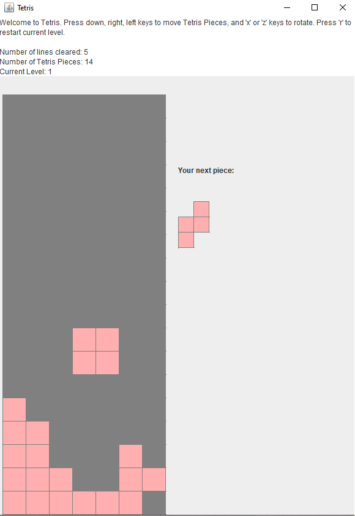
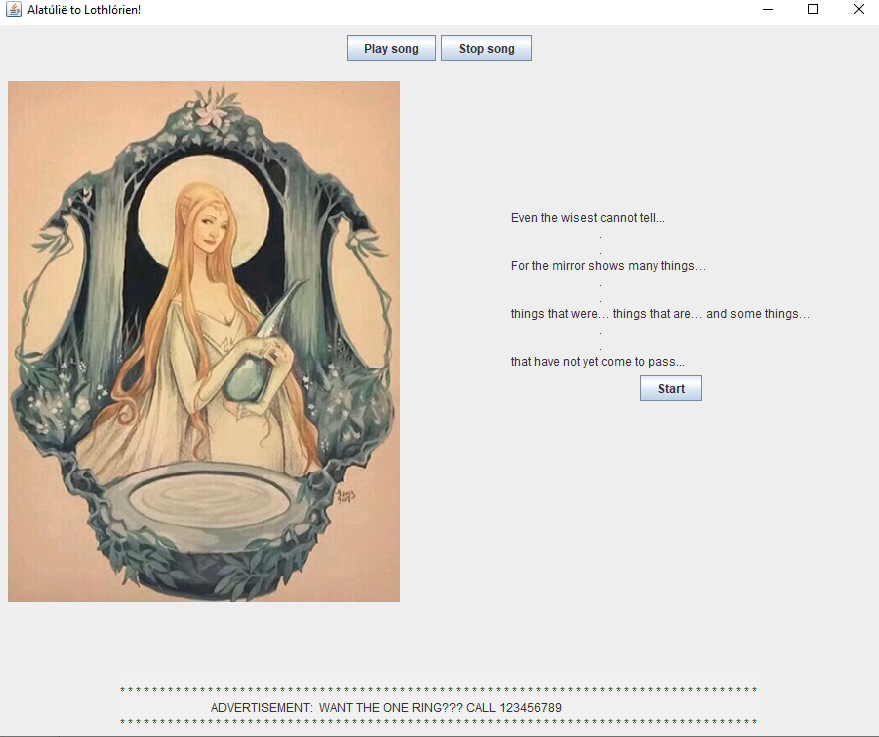

# List of Projects

## Graph Correlation Problem
Given a transaction dataset, I was tasked to find the most common set of items purchased together. 

There were two key approaches. The first was a simple correlation analysis to find the most common pairs of products. 

To extend this to finding groups of larger than two products, I implemented a graph to find groups of varying sizes to determine a list of products that are commonly purhcased together.

## Customer Segmentation Problem
Used data from https://archive.ics.uci.edu/ml/datasets/online+retail to perform Customer Segmentation (RFM Analysis).

## Object-Oriented Programming Projects
These projects were developed in Java and utilized the model-view-controller (MVC) design pattern.

* Tetris

Developed a Tetris game that can be run in an executable JAR file. Game has multiple levels where the speed of blocks falling speeds up as the user clears more rows.

     

* Twenty Questions

     

